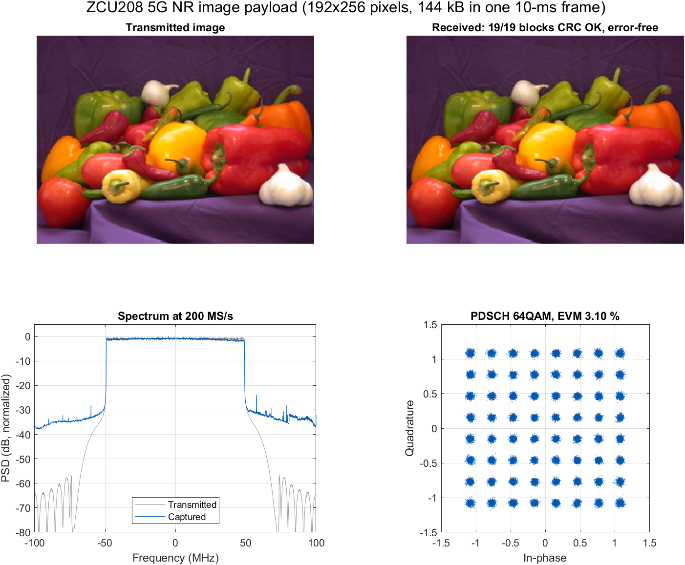
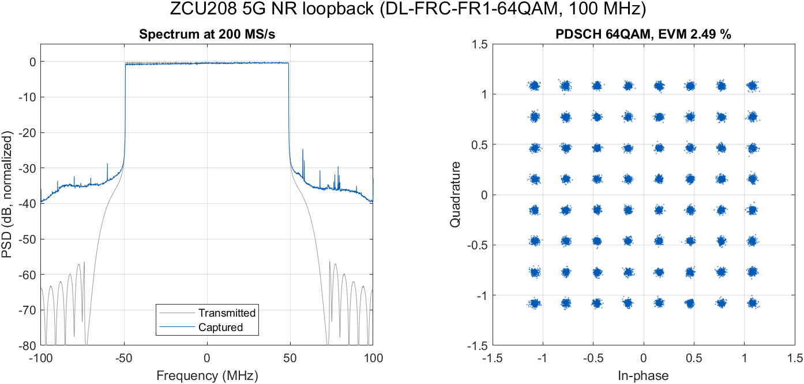

   

[English](#en) | [中文](#cn)

　

<span id="en">ZCU208 5G NR play/capture over Ethernet</span>
===========================

A reference design for the AMD Zynq UltraScale+ RFSoC ZCU208 that plays a complex-baseband waveform through an RF-DAC
and captures an RF-ADC at 200 MS/s, with the host connected over Gigabit Ethernet. The host uploads the waveform,
starts playback and capture, and reads the capture back over TCP. A lwIP server runs on the processing system, and
the programmable logic is reached over AXI. A MATLAB library and two 5G NR demos are included: an EVM loopback, and
an image carried as the PDSCH payload.

The design is modified from the Xilinx RFSoC starter design (ZCU111 DMA play/capture). See [NOTICE.md](NOTICE.md).



*`demo_image_payload.m`: a 192x256 image carried in the DL-SCH transport blocks of one 10-ms DL-FRC-FR1-64QAM frame,
played at 200 MS/s through an analog radio-over-fiber link at 3.5 GHz on the author's bench and decoded from the
RF-ADC capture: 19/19 transport blocks pass CRC, the image is received error-free, PDSCH EVM 3.10 %.*



*`demo_5gnr_loopback.m` on the same bench: DL-FRC-FR1-64QAM, 100 MHz, PDSCH EVM 2.49 %.*

Both results were produced from a fresh clone of this repository.

　

## What is in the design

| Item | Setting |
|---|---|
| Board / device | ZCU208, XCZU48DR-FSVG1517-2-E, CLK104 clocking |
| RF-DAC | DAC Tile 228 ch0 (IP tile 0, `vout00`), 4 GS/s, 20x interpolation, complex mixer, NCO -3.5 GHz |
| RF-ADC | ADC Tile 226 ch0 (IP tile 2, `vin2_01`), 4 GS/s, 20x decimation, I/Q, NCO +3.5 GHz |
| Baseband rate | 200 MS/s complex, 200-MHz fabric clock |
| Data movers | AXI DMA playback (cyclic) from DDR, AXI DMA capture to DDR |
| Host link | 1GbE (GEM3, on-board RJ45), lwIP 2.1.1 raw API, 192.168.1.10:7000 |
| Tools | Vivado / Vitis 2020.2; MATLAB (R2024a tested) |

Upload and read-back run at Ethernet speed, instead of JTAG (`dow -data` / `mrd`).

　

## Repository layout

```
hw/project.tcl          recreate the Vivado project, build the bitstream, export build/design_1_wrapper.xsa
hw/build_bd.tcl         the block design (exported with write_bd_tcl)
hw/constraints/top.xdc  pin constraints
vitis/src/              bare-metal application (RFdc/clock set-up, DMA play/capture, console, lwIP server)
xsct/build.tcl          platform + lwIP BSP + application build
xsct/program_run.tcl    program the PL, run the FSBL, start the application over JTAG
host/matlab/            RfsocEth (TCP client), play_capture_eth, demo_5gnr_loopback, demo_image_payload (+ img_*)
docs/                   lwIP settings, MATLAB library, board revision, known issues
```

Only sources are tracked. Everything generated goes to `build/`.

　

## Build and run

Use a short checkout path on Windows (see [known issues](docs/known_issues.md)).

```bash
vivado -mode batch -source hw/project.tcl
xsct xsct/build.tcl
xsct xsct/program_run.tcl
```

The first step takes about an hour. It writes `build/design_1_wrapper.xsa` with the bitstream included. The second step
creates the platform and lwIP BSP, then compiles the application to `build/vitis_ws/app/5gnr.elf`. The third step
needs `hw_server` running, the board in JTAG boot mode and a JTAG cable on the USB-JTAG port.

Cable DAC Tile 228 ch0 to ADC Tile 226 ch0, for example through a 3.5-GHz band-pass filter. Give the host NIC a
static address in 192.168.1.0/24. Then, in MATLAB:

```matlab
cd host/matlab
demo_5gnr_loopback      % EVM of a DL-FRC-FR1-64QAM frame
demo_image_payload      % an image sent as the PDSCH payload and decoded
```

Both demos need 5G Toolbox; the image demo also uses Image Processing Toolbox. `demo_5gnr_loopback` generates a
DL-FRC-FR1-64QAM frame (100 MHz, 30-kHz SCS, 10 ms), resamples it to 200 MS/s, plays it cyclically and captures
it, then reports the PDSCH EVM with the spectrum and constellation. `demo_image_payload` puts `peppers.png` into
the DL-SCH transport blocks of the same frame type (`img_make_waveform`), aligns the capture with a block-wise
correlation that tolerates the residual DAC/ADC frequency offset (`img_align`), and decodes it with a PDSCH
receiver and LDPC decoding (`img_rx_decode`). Pixels of transport blocks that fail CRC are painted grey.

　

## Host API in one example

```matlab
E = RfsocEth();                          % 192.168.1.10:7000
E.write(hex2dec('40001000'), bytes);     % waveform -> DDR play buffer
E.cmd('dacPlay 8192');                   % cyclic playback of 8192 KB
E.cmd('adcCapture 16384');               % capture 16 MB
b = E.read(hex2dec('10001000'), 16384*1024);
```

`play_capture_eth` wraps these steps. The wire protocol, memory formats and console commands are in
[docs/matlab_library.md](docs/matlab_library.md).

　

## Citation

If this work helps your research, please cite it:

```bibtex
@misc{yu2026zcu208_5gnr,
    author = {Yijie Yu},
    title = {{ZCU208 5G NR play/capture over Ethernet}},
    year = {2026},
    howpublished = {\url{https://github.com/uceeyuf/zcu208_dma_5gnr_lwip}},
    note = {GitHub repository},
}
```

GitHub also offers the citation under **Cite this repository** (from [CITATION.cff](CITATION.cff)).

　

## Licence

BSD 3-Clause for the new work in this repository; files from the Xilinx RFSoC starter design keep their original
terms. See [LICENSE](LICENSE) and [NOTICE.md](NOTICE.md).

　

　

<span id="cn">ZCU208 5G NR 以太网播放/采集</span>
===========================

面向 AMD Zynq UltraScale+ RFSoC ZCU208 的参考设计：以 200 MS/s 通过 RF-DAC 播放复基带波形，并采集 RF-ADC 数据，
上位机经千兆以太网连接。上位机上传波形、启动播放和采集，再经 TCP 读回采集数据。处理器系统上运行 lwIP 服务器，
可编程逻辑经 AXI 访问。仓库附带一个 MATLAB 库和两个 5G NR 演示：EVM 环回，以及把一张图片作为 PDSCH 负载传输。

本设计由 Xilinx RFSoC 入门设计（ZCU111 DMA play/capture）修改而来，见 [NOTICE.md](NOTICE.md)。


*`demo_image_payload.m`：一张 192x256 的图片装入一个 10 ms DL-FRC-FR1-64QAM 帧的 DL-SCH 传输块，在作者的实验台上
以 200 MS/s 经 3.5 GHz 模拟光载无线链路播放，再从 RF-ADC 采集数据中解码：19/19 个传输块 CRC 通过，图片无误码接收，
PDSCH EVM 3.10 %。*


*`demo_5gnr_loopback.m`，同一实验台：DL-FRC-FR1-64QAM，100 MHz，PDSCH EVM 2.49 %。*

两个结果都是从本仓库全新 clone 后得到的。

　

## 设计内容

| 项目 | 设置 |
|---|---|
| 板卡 / 器件 | ZCU208，XCZU48DR-FSVG1517-2-E，CLK104 时钟板 |
| RF-DAC | DAC Tile 228 ch0（IP tile 0，`vout00`），4 GS/s，20 倍内插，复数混频，NCO -3.5 GHz |
| RF-ADC | ADC Tile 226 ch0（IP tile 2，`vin2_01`），4 GS/s，20 倍抽取，I/Q，NCO +3.5 GHz |
| 基带速率 | 200 MS/s 复数，逻辑时钟 200 MHz |
| 数据搬运 | AXI DMA 从 DDR 循环播放，AXI DMA 采集到 DDR |
| 上位机链路 | 千兆以太网（GEM3，板载 RJ45），lwIP 2.1.1 raw API，192.168.1.10:7000 |
| 工具 | Vivado / Vitis 2020.2；MATLAB（R2024a 已测试） |

上传和读回都以以太网速度进行，不再经 JTAG（`dow -data` / `mrd`）。

　

## 目录结构

```
hw/project.tcl          重建 Vivado 工程，生成比特流，导出 build/design_1_wrapper.xsa
hw/build_bd.tcl         block design（由 write_bd_tcl 导出）
hw/constraints/top.xdc  管脚约束
vitis/src/              裸机应用（RFdc/时钟配置、DMA 播放/采集、控制台、lwIP 服务器）
xsct/build.tcl          平台 + lwIP BSP + 应用编译
xsct/program_run.tcl    经 JTAG 下载 PL、运行 FSBL、启动应用
host/matlab/            RfsocEth（TCP 客户端）、play_capture_eth、demo_5gnr_loopback、demo_image_payload（及 img_*）
docs/                   lwIP 设置、MATLAB 库、板卡版本、已知问题（英文）
```

仓库只跟踪源文件，所有生成文件都放在 `build/`。

　

## 编译与运行

在 Windows 上请使用较短的检出路径（见[已知问题](docs/known_issues.md)）。

```bash
vivado -mode batch -source hw/project.tcl
xsct xsct/build.tcl
xsct xsct/program_run.tcl
```

第一步约需一小时，生成包含比特流的 `build/design_1_wrapper.xsa`。第二步创建平台和 lwIP BSP，然后把应用编译为
`build/vitis_ws/app/5gnr.elf`。第三步需要 `hw_server` 已运行、板卡处于 JTAG 启动模式，并在 USB-JTAG 口接好 JTAG 线。

用线缆把 DAC Tile 228 ch0 接到 ADC Tile 226 ch0，例如经过一个 3.5 GHz 带通滤波器。给上位机网卡设置 192.168.1.0/24 网段的
静态地址。然后在 MATLAB 中：

```matlab
cd host/matlab
demo_5gnr_loopback      % DL-FRC-FR1-64QAM 帧的 EVM
demo_image_payload      % 把图片作为 PDSCH 负载发送并解码
```

两个演示都需要 5G Toolbox，图片演示还用到 Image Processing Toolbox。`demo_5gnr_loopback` 生成一个 DL-FRC-FR1-64QAM 帧
（100 MHz，30 kHz 子载波间隔，10 ms），重采样到 200 MS/s，循环播放并采集，然后给出 PDSCH EVM 以及频谱和星座图。
`demo_image_payload` 把 `peppers.png` 装入同类帧的 DL-SCH 传输块（`img_make_waveform`），用一种能容忍 DAC/ADC 残余频偏的
分块相关对齐采集数据（`img_align`），再用 PDSCH 接收机和 LDPC 译码解出图片（`img_rx_decode`）。CRC 失败的传输块对应的像素涂成灰色。

　

## 上位机接口示例

```matlab
E = RfsocEth();                          % 192.168.1.10:7000
E.write(hex2dec('40001000'), bytes);     % 波形 -> DDR 播放缓冲区
E.cmd('dacPlay 8192');                   % 循环播放 8192 KB
E.cmd('adcCapture 16384');               % 采集 16 MB
b = E.read(hex2dec('10001000'), 16384*1024);
```

`play_capture_eth` 封装了以上步骤。通信协议、内存格式和控制台命令见 [docs/matlab_library.md](docs/matlab_library.md)。

　

## 引用

如果这个项目对你的研究有帮助，请引用：

```bibtex
@misc{yu2026zcu208_5gnr,
    author = {Yijie Yu},
    title = {{ZCU208 5G NR play/capture over Ethernet}},
    year = {2026},
    howpublished = {\url{https://github.com/uceeyuf/zcu208_dma_5gnr_lwip}},
    note = {GitHub repository},
}
```

GitHub 仓库页的 **Cite this repository** 也提供同样的引用（来自 [CITATION.cff](CITATION.cff)）。

　

## 许可

本仓库中的新增工作采用 BSD 3-Clause；来自 Xilinx RFSoC 入门设计的文件保留其原有条款。见 [LICENSE](LICENSE) 和 [NOTICE.md](NOTICE.md)。
